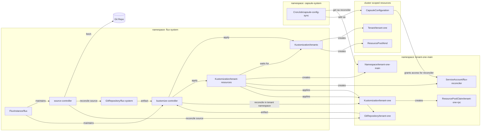

# Capsule + FluxCD Multi-Tenant GitOps

This project demonstrates a practical multi-tenant GitOps setup with:

- Capsule for tenant isolation and policy boundaries.
- FluxCD controllers for cluster-level and tenant-level reconciliation.
- A CronJob-based sync loop that promotes tenant ServiceAccounts into `CapsuleConfiguration` to set permissions for Flux manage tenant resources in their namespaces.

## Architecture



## Why This Over clastix/flux2-capsule-multi-tenancy?

Compared to the [reference repository](https://github.com/clastix/flux2-capsule-multi-tenancy), this project focuses on an operational flow that is easier to run and extend in a lab or platform bootstrap context:

- Flux lifecycle is declared through `FluxInstance` (`flux-instance.yaml`) instead of only static controller manifests.
- Tenant RBAC promotion is automated with a periodic `CronJob` (`sa-sync.yaml`) that updates `CapsuleConfiguration` from labeled ServiceAccounts.
- Reconciliation is explicitly split into cluster-level and tenant-level pipelines (`tenant-sync.yaml`, `tenant-resources-sync.yaml`, `tenant-repo/tenant-one/tenant-sync.yaml`).
- It avoids the more complex impersonation-and-token-generation pattern used in `clastix/flux2-capsule-multi-tenancy`, reducing setup and operational overhead.

## Run

Prerequisites:
- A running Kubernetes cluster.
- `kubectl` and `helm`.

1. Install Flux Operator:

```bash
helm install flux-operator oci://ghcr.io/controlplaneio-fluxcd/charts/flux-operator --namespace flux-system --create-namespace
```

2. Apply the project manifests:

```bash
kubectl apply -f flux-instance.yaml
```

3. Verify reconciliation:

```bash
kubectl get gitrepositories -A
kubectl get kustomizations -A
kubectl get helmreleases -A
kubectl get helmrepositories -A
```

4. View created tenants
```bash
kubectl get tenants -A
```

5. Apply tenant resources exaple
```
kubectl apply -f tenant-repo/tenant-one
```

6. Verify tenant isolation with `--as` impersonation:

```bash
kubectl -n tenant-two-main run --as system:serviceaccount:tenant-two:flux-reconciler nginx --image=nginx --overrides='[{"op":"replace","path":"/spec/containers/0/resources/limits","value":{"memory":"50Mi","cpu":"50m"}}]' --override-type=json
```

Expected result:

```text
pod/nginx created
```

```bash
kubectl -n tenant-one-main run --as system:serviceaccount:tenant-two:flux-reconciler nginx --image=nginx --overrides='[{"op":"replace","path":"/spec/containers/0/resources/limits","value":{"memory":"50Mi","cpu":"50m"}}]' --override-type=json
```

Expected result:

```text
Error from server (Forbidden): pods is forbidden: User "system:serviceaccount:tenant-two:flux-reconciler" cannot create resource "pods" in API group "" in the namespace "tenant-one-main"
```

7. Generate users via script
```bash
./hack/create-user.sh tenant-one-owner tenant-one
```

8. Create new namespace for tenant
```bash
KUBECONFIG=tenant-one-owner-tenant-one.kubeconfig kubectl create ns tenant-one-new-ns
```
